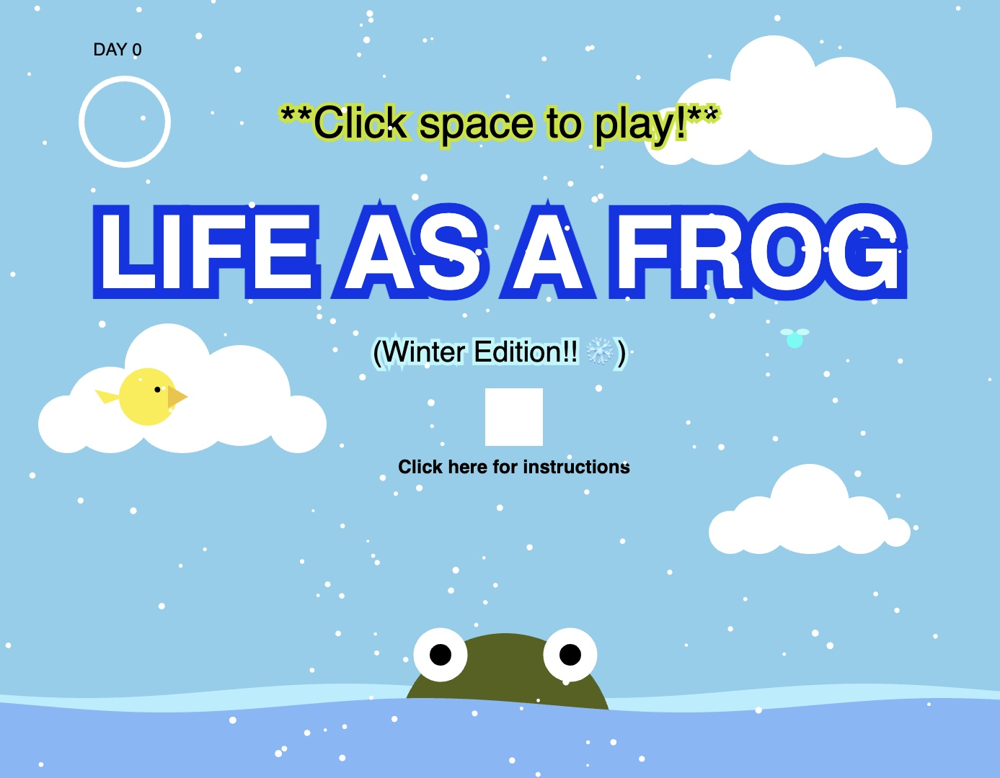
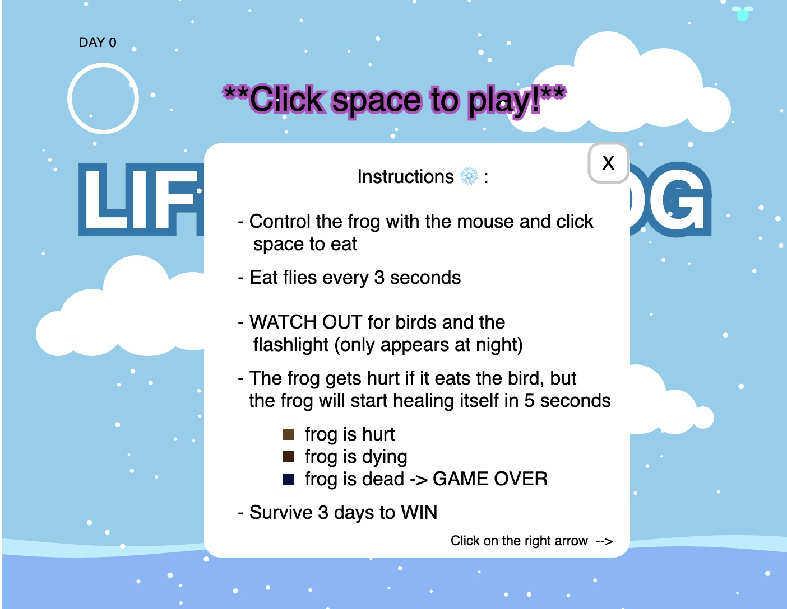
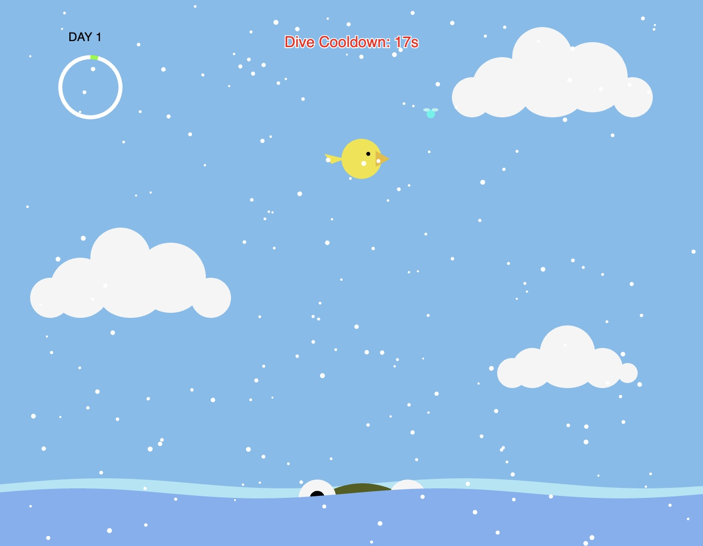
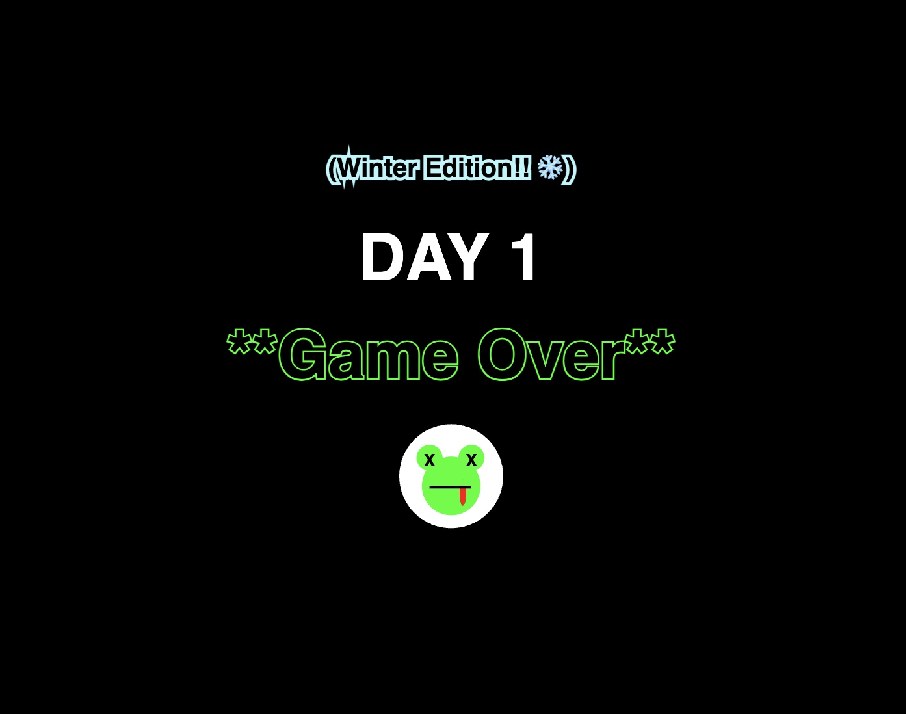

# Animal Sanctuary

Yaxuan Pang

[View this project online](https://yaxuanpang.github.io/cart253/topics/variation-jam-winter/)

[View original variation](https://yaxuanpang.github.io/cart253/topics/variation-jam-original/)

[View spring variation](https://yaxuanpang.github.io/cart253/topics/variation-jam-spring/)

[View summer variation](https://yaxuanpang.github.io/cart253/topics/variation-jam-summer/)

[View fall variation](https://yaxuanpang.github.io/cart253/topics/variation-jam-autumn/)

## Description

## Screenshot(s)

> 
> 
> 
> 
> 

## Attribution

> - This project uses [p5.js](https://p5js.org).
> - This projects uses the code from the variables challenge (https://concordia.yuja.com/V/Video?v=1071104&node=5700521&a=117175823)
> - This projects uses the code from the conditionals challenge (https://yaxuanpang.github.io/cart253/topics/conditionals-challenge/)
> - This projects uses the code from (https://editor.p5js.org/TheCurlyPasta/sketches/HkbMtLNJV) for the snowflakes.

## License

> This project is licensed under a Creative Commons Attribution ([CC BY 4.0](https://creativecommons.org/licenses/by/4.0/deed.en)) license with the exception of libraries and other components with their own licenses.